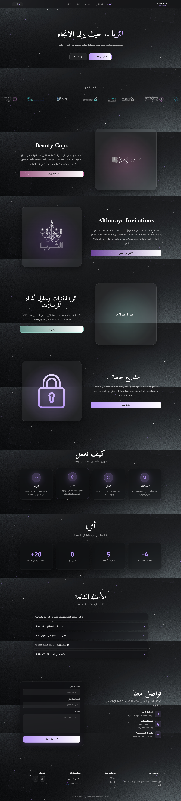

# Althuraya Venture Builder – Front-End Portfolio Website (RTL/LTR)

Designed, developed, and deployed the official bilingual portfolio website for Althuraya Venture Builder during my internship.
Led the full front-end implementation from scratch, structured the site architecture, built responsive UI components, 
implemented Arabic/English (RTL/LTR) support, and managed deployment using Netlify with GitHub integration.

## 🧩 Website Sections
- Home
- Success Partners
- Ventures
- How We Work
- Our Impact
- FAQ
- Contact

## 🔧 Tools
- HTML
- CSS
- JavaScript
- GitHub
- Hosted using Netlify
- Prompt Engineering & AI-assisted Web Development Tools

## 🌐 Live Demo
https://althuraya.netlify.app/

## 📸 Images

